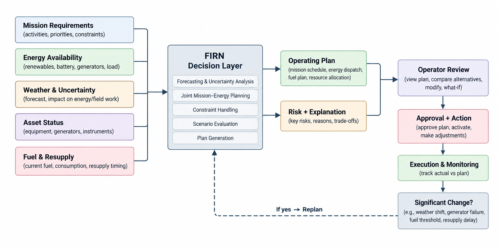

# FIRN

## Mission-aware energy resilience for polar research stations

FIRN is a mission-aware energy resilience system for polar research stations.

It helps station operators reason about one connected question:

> What can the station safely accomplish next, given the missions that matter, the energy available, the weather ahead, and the resources that must be protected?

FIRN connects mission planning and energy management in one operating view. It evaluates conditions, identifies risk, recommends an operating plan, and explains the reasoning behind each decision.

## Operating model

<p align="center">
  
</p>

*Figure 1. FIRN connects station inputs, decision support, operator approval, execution monitoring, and adaptive replanning.*

The operator remains in control. FIRN recommends, explains, and adapts; it does not silently activate a plan or control physical station equipment.

## Workspace

| Area | Function |
| --- | --- |
| **Station Overview** | Current station condition, mission status, energy position, fuel reserve, weather risk, and operating recommendation |
| **Mission Planner** | Mission priorities, deadlines, energy requirements, asset constraints, and schedule generation |
| **Energy & Assets** | Renewable generation, battery state, generator availability, asset health, and operational constraints |
| **Forecast & Risk** | Renewable generation, demand, battery trajectory, forecast confidence, and upcoming risk |
| **Scenario Simulator** | Storm, generator failure, fuel delay, and low-battery conditions with adaptive plan responses |
| **Decision Log** | The sequence of observations, assessments, actions, and explanations behind an operating decision |

## The operating loop

FIRN is organized around a rolling decision cycle:

1. **Sense** — establish the current station, mission, asset, weather, and fuel state.
2. **Predict** — project demand, renewable availability, battery reserve, and operating risk.
3. **Plan** — align mission timing with energy and infrastructure constraints.
4. **Explain** — show the trade-offs, risks, and reasons behind the recommendation.
5. **Review** — allow the operator to inspect and adjust the proposed plan.
6. **Approve** — make the selected plan active through an explicit operator action.
7. **Adapt** — respond to significant changes with a new plan version and comparison.

Plan state is explicit:

```text
DRAFT → PROPOSED → APPROVED → ACTIVE → SUPERSEDED
```

No proposed plan should become active without an operator action.

## Decision dimensions

FIRN brings five operational dimensions together:

### Mission-aware

Scientific activities are first-class planning objects with priority, duration, deadlines, energy demand, weather dependency, equipment, personnel, and flexibility.

### Energy-aware

Renewables, station demand, battery reserve, generator capacity, and critical loads are considered together rather than displayed as disconnected metrics.

### Fuel-aware

Finite fuel, consumption, reserve thresholds, and resupply timing influence which missions remain feasible.

### Weather-aware

Weather affects both renewable generation and the safety or feasibility of field activity.

### Human-in-the-loop

FIRN provides recommendations and explanations. The operator reviews, modifies, approves, and remains accountable for the active plan.

## Operating environment

The current station environment is synthetic, deterministic, and local to the browser. This keeps the operating model reproducible while the planning experience is developed.

The current system does not connect to live telemetry, real station infrastructure, external weather services, or a remote planning service. Synthetic values are intentionally identified as simulated wherever they appear in the interface.

The frontend simulation is structured so that deterministic local planning functions can later be replaced by typed service calls without changing the operator-facing workflow.

## System structure

```text
src/
├── components/
│   ├── firn/          Shared FIRN shell and product components
│   └── ui/            Reusable interface primitives
├── lib/
│   ├── firn-data.ts   Station, mission, asset, scenario, forecast, and log data
│   ├── firn-context.tsx
│   └── error-*.ts     Runtime and server error handling
├── routes/            TanStack Start workspace screens
├── router.tsx         Router creation and application context
├── start.ts           Request middleware and application startup
└── server.ts          SSR entry and server error handling
public/                Static public assets
```

The long-term separation is:

```text
Presentation
    ↓
Application workflow
    ↓
Planning and simulation services
    ↓
Domain models and constraints
    ↓
Station data and integrations
```

Simulation and planning logic should remain independent of route components so the same domain behavior can power the overview, planner, monitoring, scenarios, and decision history.

## Future service boundary

The current application runs locally, but the product boundary is designed to support a backend when persistence, collaboration, and live integrations become necessary.

```text
backend/
├── api/              Planning, monitoring, scenarios, and plan lifecycle
├── domain/           Mission, station, asset, fuel, risk, and plan models
├── simulation/       Deterministic simulation and optimization services
├── persistence/      Plans, history, users, and station state
└── integrations/     Weather, telemetry, and external station systems
```

The future service layer should preserve the same contracts and principles:

- mission and energy planning remain coupled;
- critical loads are protected;
- fuel cannot become negative;
- battery state remains within physical limits;
- hard weather, resource, and deadline constraints are respected;
- significant changes create a new plan version;
- historical plans remain immutable;
- operators explicitly approve recommendations;
- synthetic station data is never represented as live telemetry.

## Technology

- React 19
- TypeScript
- TanStack Start and TanStack Router
- Tailwind CSS
- Recharts
- Lucide icons
- Vite

## Run locally

### Requirements

- Node.js 20 or newer
- npm

### Start FIRN

```sh
npm install
npm run dev
```

Open the local URL printed by Vite.

### Useful commands

```sh
npm run build    # Build the application for production
npm run preview  # Preview the production build
npm run lint     # Run ESLint
```

## Product principles

FIRN should always feel like a specialized polar operations system rather than a generic dashboard.

- Protect critical station operations before flexible science activity.
- Make every major recommendation understandable.
- Show the relationship between mission timing and energy availability.
- Preserve plan history instead of silently rewriting decisions.
- Distinguish proposed, approved, active, and superseded plans.
- Prefer deterministic, testable behavior over opaque automation.
- Keep the operator in control of approval and execution.
- Be precise about what is simulated and what is connected.
